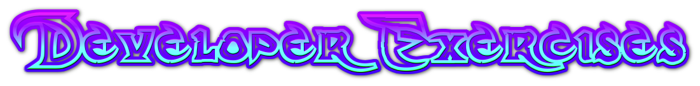

# Dev_Exercises

[![Contributors][contributors-shield]][contributors-url]
[![Forks][forks-shield]][forks-url]
[![Stargazers][stars-shield]][stars-url]
[![Issues][issues-shield]][issues-url]
[![MIT License][license-shield]][license-url]
[![LinkedIn][linkedin-shield]][linkedin-url]

<head>
  <link rel="stylesheet" href="https://cdnjs.cloudflare.com/ajax/libs/animate.css/4.1.1/animate.min.css"/>
</head>

<!-- PROJECT LOGO -->
<br />
<p align="center">
  <a href="https://github.com/DavidsDvm/Dev_Exercises">
    
  </a>

  <h3 align="center" class="animate__animated animate__wobble">Developer exercises DavidsDvm</h3>

  <p align="center">
    Welcome to my developer exercises, this is a personal proyect where i put my daily dev excercises with the objetive of improve my skills on the developing 
    <br />
    <a href="https://github.com/DavidsDvm/Dev_Exercises"><strong>Explore the docs »</strong></a>
    <br />
    <br />
    <a href="https://github.com/DavidsDvm/Dev_Exercises">View Demo</a>
    ·
    <a href="https://github.com/DavidsDvm/Dev_Exercises/issues">Report Bug</a>
    ·
    <a href="https://github.com/DavidsDvm/Dev_Exercises/issues">Request Feature</a>
  </p>
</p>


<!-- TABLE OF CONTENTS -->
<details open="open">
  <summary>Table of Contents</summary>
  <ol>
    <li>
      <a href="#about-the-project">About The Project</a>
      <ul>
        <li><a href="#built-with">Built With</a></li>
      </ul>
    </li>
    <li>
      <a href="#getting-started">Getting Started</a>
      <ul>
        <li><a href="#prerequisites">Prerequisites</a></li>
      </ul>
    </li>
    <li><a href="#usage">Usage</a></li>
    <li><a href="#roadmap">Roadmap</a></li>
    <li><a href="#contributing">Contributing</a></li>
    <li><a href="#license">License</a></li>
    <li><a href="#contact">Contact</a></li>
    <li><a href="#acknowledgements">Acknowledgements</a></li>
  </ol>
</details>


<!-- ABOUT THE PROJECT -->
## About The Project

![Product Name Screen Shot][product-screenshot]

In this project i will daily develop new programs and exercises with the objetive of improve my dev skills, i going to use too many dev tools and new ejercises ideas, in this initial fase i will stay learning 2 new leanguages (JavaScript - Python)

Here's why:
* I really enjoy learning every day, i am a person that likes learn something new.
* I want to learn JavaScript and Python due to the new working oportunities that provides this dev lenguages
* I love develop :smile:

By the way i will upload some exercises in other lenguages not only on (javaScript - Python) so if you see PHP exercises or C# exercises don't scary thats normal this repository will have too many exercises on too many lenguages.

A list of commonly used resources that I find helpful are listed in the acknowledgements.

### Built With

This section should list any major frameworks that you built your project using. Leave any add-ons/plugins for the acknowledgements section. Here are a few examples.
* [Bootstrap](https://getbootstrap.com)
* [JQuery](https://jquery.com)
* [Laravel](https://laravel.com)


<!-- GETTING STARTED -->
## Getting Started

This a proyect where i put my exercises if you wanna try that exercises you need the tools of that respective lenguage

### Prerequisites


* npm
  ```sh
  npm install npm@latest -g
  ```

  * Python - debian, ubuntu, kali
  ```sh
  sudo apt-get install python
  ```
  * Python - Archlinux, Manjaro
  ```sh
  sudo pacman -s python
  ```


<!-- USAGE EXAMPLES -->
## Usage

Use this space to show useful examples of how a project can be used. Additional screenshots, code examples and demos work well in this space. You may also link to more resources.

_For more examples, please refer to the [Documentation](https://github.com/DavidsDvm/Dev_Exercises/wiki)_


<!-- ROADMAP -->
## Roadmap

See the [open issues](https://github.com/DavidsDvm/Dev_Exercises/issues) for a list of proposed features (and known issues).


<!-- CONTRIBUTING -->
## Contributing

Contributions are what make the open source community such an amazing place to be learn, inspire, and create. Any contributions you make are **greatly appreciated**.

1. Fork the Project
2. Create your Feature Branch (`git checkout -b feature/AmazingFeature`)
3. Commit your Changes (`git commit -m 'Add some AmazingFeature'`)
4. Push to the Branch (`git push origin feature/AmazingFeature`)
5. Open a Pull Request


<!-- LICENSE -->
## License

Distributed under the MIT License. See `LICENSE` for more information.


<!-- CONTACT -->
## Contact

David Vargas - [@DavidsDvm](https://twitter.com/DavidsDvm) - dvargas896@misena.edu.co

Project Link: [https://github.com/DavidsDvm/Dev_Exercises](https://github.com/DavidsDvm/Dev_Exercises)


<!-- ACKNOWLEDGEMENTS -->
## Acknowledgements
* [GitHub Emoji Cheat Sheet](https://www.webpagefx.com/tools/emoji-cheat-sheet)
* [Img Shields](https://shields.io)
* [Choose an Open Source License](https://choosealicense.com)
* [GitHub Pages](https://pages.github.com)
* [Animate.css](https://daneden.github.io/animate.css)
* [Loaders.css](https://connoratherton.com/loaders)
* [Slick Carousel](https://kenwheeler.github.io/slick)
* [Smooth Scroll](https://github.com/cferdinandi/smooth-scroll)
* [Sticky Kit](http://leafo.net/sticky-kit)
* [JVectorMap](http://jvectormap.com)
* [Font Awesome](https://fontawesome.com)


<!-- MARKDOWN LINKS & IMAGES -->
<!-- https://www.markdownguide.org/basic-syntax/#reference-style-links -->
[contributors-shield]: https://img.shields.io/github/contributors/DavidsDvm/Dev_Exercises.svg?style=for-the-badge
[contributors-url]: https://github.com/DavidsDvm/Dev_Exercises/graphs/contributors
[forks-shield]: https://img.shields.io/github/forks/DavidsDvm/Dev_Exercises.svg?style=for-the-badge
[forks-url]: https://github.com/DavidsDvm/Dev_Exercises/network/members
[stars-shield]: https://img.shields.io/github/stars/DavidsDvm/Dev_Exercises.svg?style=for-the-badge
[stars-url]: https://github.com/DavidsDvm/Dev_Exercises/stargazers
[issues-shield]: https://img.shields.io/github/issues/DavidsDvm/Dev_Exercises.svg?style=for-the-badge
[issues-url]: https://github.com/DavidsDvm/Dev_Exercises/issues
[license-shield]: https://img.shields.io/github/license/DavidsDvm/Dev_Exercises.svg?style=for-the-badge
[license-url]: https://github.com/DavidsDvm/Dev_Exercises/blob/master/LICENSE.txt
[linkedin-shield]: https://img.shields.io/badge/-LinkedIn-black.svg?style=for-the-badge&logo=linkedin&colorB=555
[linkedin-url]: https://www.linkedin.com/in/davidsdvm/
[product-screenshot]: img/code.jpg
